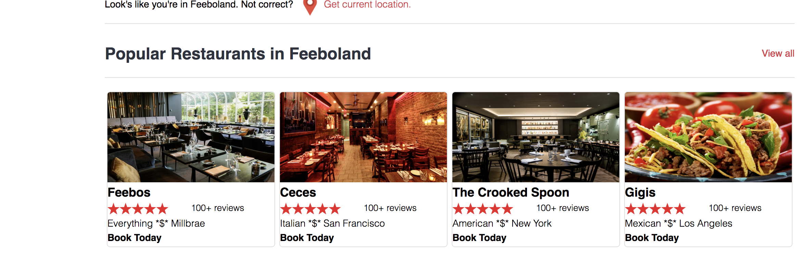

# BrokenFork

BrokenFork is a single page application inspired by OpenTable. It is a full-stack application where HTML/CSS, Javascript, React/Redux is used on the front-end, Ruby on Rails on the back-end, and stored in PostgreSQL Database.

[Live Site](https://broken-fork.herokuapp.com/#/)

# Features

* Secure frontend to backend user authentication using BCrypt
* User may view restaurants
* Link to better website on every page

## Setup

* `git clone the repo with the url:` https://github.com/anthonyltam/Broken-Fork
* `gem install`
* `bundle install`
* `npm install`
* `bundle exec rails db:setup` - to create database files and seed the database
* `npm run start`

## Dependencies

* `Ruby version 2.5.1`, `NodeJS`, and `PostgreSQL version 10` installed on your machine

* Requires Install of `NodeJS` for node-package-manager (`npm`)

* The frontend is compiled with `webpack` that generates a `dist/bundle.js` file from the entrypoint file `./frontend/broken_fork.jsx`.  
  - The routes for this webpack configuration can be fount in the `webpack.config.js` file

## Functionality

* `Users can search restaurants`

* `Users can select featured restaurants`

# Future Features

* Users will hopefully be able to make reservations and write reviews in the near future
